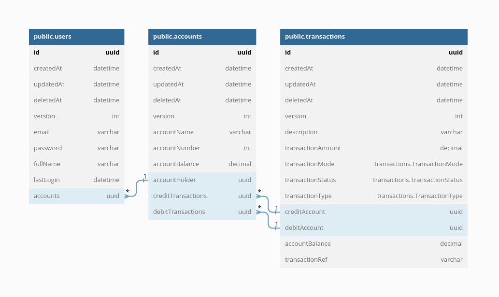

# Wallet Service API

## About

This is a Wallet Service Provider designed with a self-self approach, Users can open wallet(s) while an existing wallet holder can perform the following:

* Open one or more wallets
* Check their wallet balance
* Deposit Funds into their Wallet(s)
* Withdraw Funds from their Wallet(s)
* Transfer Funds Between Internal Wallet(s)
* View All their transaction history

#### CREATE WALLETS:

* Users can create and operate multiple wallets.
* 10-digit Wallet Numbers are automatically generated internally when opening new wallets.
* Authentication is required for opening new wallets and the wallet is automatically tagged to the user opening the wallet.

#### DEPOSIT FUNDS:

* Users can deposit funds into their wallets.
* Checks are in place to validate the wallet name and wallet number supplied for the transaction.
* Credit Transaction Details are automatically generated for the deposit and mapped to the credited wallet.
* Authentication is required to perform this operation.

#### WITHDRAW FUNDS:

* Users can withdraw funds from their wallets.
* Users can only withdraw funds from wallets belonging to them.
* Checks are in place to validate the wallet name and wallet number supplied for the transaction.
* A transaction would only be successful if the debit wallet balance is greater than the amount to withdraw.
* Debit Transaction Details are automatically generated for the deposit and mapped to the debitted wallet.
* Authentication is required to perform this operation

#### TRANSFER FUNDS:

* Users can transfer funds from their wallets to other internal wallets.
* Users can only transfer funds from wallets belonging to them.
* Checks are in place to validate the credit and debit wallet details supplied for the transaction.
* A transaction would only be successful if the debit wallet balance is greater than the amount to transfer.
* Debit Transaction Details are automatically generated against the debitted wallet for the transfer.
* Credit Transaction Details are automatically generated against the creditted wallet for the transfer.
* Authentication is required to perform this operation

## Authors

- [@greazleay](https://www.github.com/greazleay)


## Tech Stack

**Server:** Node

* [TypeScript](https://www.typescriptlang.org/)
* [Node.js](https://nodejs.org/en/)
* [ExpressJS](https://expressjs.com/)
* [MySQL](https://www.mysql.com/)
* [TypeORM](https://typeorm.io/)
* [Passportjs](https://www.passportjs.org/)
* [Passport-Jwt](https://www.passportjs.org/packages/passport-jwt/)
* [Jsonwebtoken](https://www.npmjs.com/package/jsonwebtoken)
* [Redis](https://redis.io/)
* [WinstonJS](https://github.com/winstonjs/winston)
* [Jest](https://jestjs.io/)
* [Supertest](https://www.npmjs.com/package/supertest)

## Installation

```bash
  yarn
  # or
  npm install
```

## Running the app

```bash
# development
$ yarn dev
  # or
$ npm run dev

# production mode
$ yarn start
  # or
$ npm run start
```

## Documentation

Full API Documentation is available [here](https://documenter.getpostman.com/view/13908166/2s83ziPQ2Z)

## Entity Relationship Diagram (ERD)




## API Reference

Some of the available routes are listed below:

#### Authentication Routes

##### Auth Login

```http
  POST /auth/login
```

| Parameter | Type     | Description                |
| :-------- | :------- | :------------------------- |
| `email` | `string` | **Required**. Your Valid Email |
| `password` | `string` | **Required**. Your Valid Password |


#### User Routes

##### Register

```http
  POST /users/register
```

| Parameter | Type     | Description                |
| :-------- | :------- | :------------------------- |
| `email` | `string` | **Required**. Valid Email Address|
| `password` | `string` | **Required**. Password |
| `fullName` | `string` | **Required**. User's full name |

##### Get User Info

```http
  GET /users/userinfo
```

| Parameter | Type     | Description                       |
| :-------- | :------- | :-------------------------------- |
| `access_token`      | `string` | **Required**. Valid Access Token |

#### Wallet Routes

##### Create Wallet

```http
  POST /wallets
```

| Parameter | Type     | Description                       |
| :-------- | :------- | :-------------------------------- |
| `access_token`      | `string` | **Required**. Valid Access Token |
| `walletName` | `string` | **Required**. Name of the Wallet|

##### Deposit Funds

```http
  POST /wallets/deposit
```

| Parameter | Type     | Description                       |
| :-------- | :------- | :-------------------------------- |
| `access_token`      | `string` | **Required**. Valid Access Token |
| `walletNumber` | `number` | **Required**. 10-digit wallet number|
| `walletName` | `string` | **Required**. Name of the wallet|
| `transactionAmount` | `number` | **Required**. Amount to withdraw |
| `transactionParty` | `string` | **Required**. User making the transaction |

##### Withdraw Funds

```http
  POST /wallets/withdraw
```

| Parameter | Type     | Description                       |
| :-------- | :------- | :-------------------------------- |
| `access_token`      | `string` | **Required**. Valid Access Token |
| `walletNumber` | `number` | **Required**. 10-digit wallet number|
| `transactionAmount` | `number` | **Required**. Amount to withdraw |
| `transactionParty` | `string` | **Required**. User making the transaction |

##### Transfer Funds

```http
  POST /wallets/transfer
```

| Parameter | Type     | Description                       |
| :-------- | :------- | :-------------------------------- |
| `access_token`      | `string` | **Required**. Valid Access Token |
| `debitWalletNumber` | `number` | **Required**. 10-digit Wallet number to debit|
| `creditWalletNumber` | `number` | **Required**. 10-digit Wallet number to credit|
| `creditWalletName` | `string` | **Required**. Name of the Wallet to credit |
| `transferAmount` | `number` | **Required**. Amount to Transfer |

## License

[MIT](https://choosealicense.com/licenses/mit/)


## 🔗 Links
[](https://pollaroid.net/)
[](https://www.linkedin.com/in/siezes)


## Badges

[](https://github.com/tterb/atomic-design-ui/blob/master/LICENSEs)
[](https://github.com/greazleay/thrifty-api/)