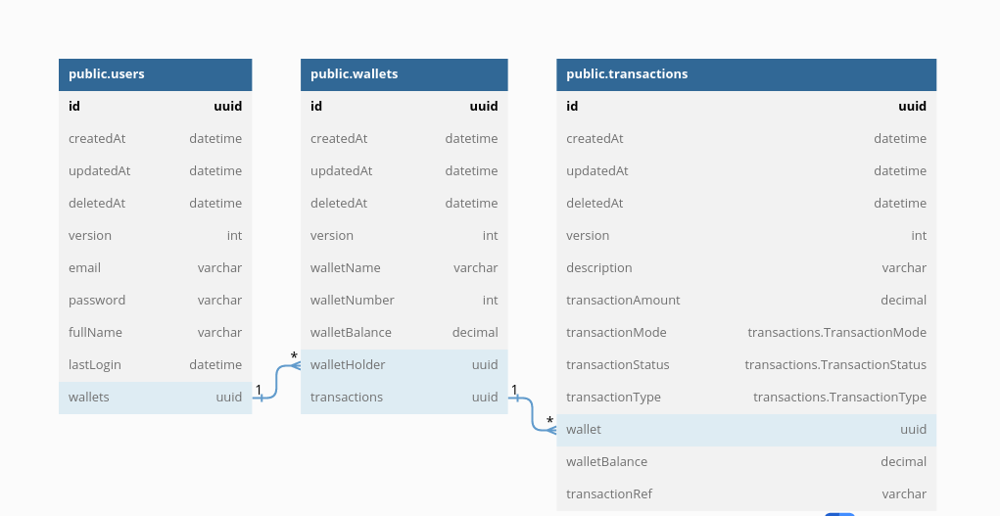

# Demo Credit API

## About

This is a Demo Wallet Service Provider designed with a self-self approach, Users can open account(s) while an existing account holder can perform the following:

* Open one or more accounts
* Check their account balance
* Deposit Funds into their Account(s)
* Withdraw Funds from their Account(s)
* Transfer Funds Between Internal Account(s)
* View All their transaction history

#### ACCOUNT OPENING:

* Users can open and operate multiple accounts.
* 10-digit Account Numbers are automatically generated internally when opening new accounts.
* Authentication is required for opening new accounts and the account is automatically tagged to the user opening the account.

#### DEPOSIT FUNDS:

* Users can deposit funds into their accounts.
* Checks are in place to validate the account name and account number supplied for the transaction.
* Credit Transaction Details are automatically generated for the deposit and mapped to the credited account.
* Authentication is required to perform this operation.

#### WITHDRAW FUNDS:

* Users can withdraw funds from their accounts.
* Users can only withdraw funds from accounts belonging to them.
* Checks are in place to validate the account name and account number supplied for the transaction.
* A transaction would only be successful if the debit account balance is greater than the amount to withdraw.
* Debit Transaction Details are automatically generated for the deposit and mapped to the debitted account.
* Authentication is required to perform this operation

#### TRANSFER FUNDS:

* Users can transfer funds from their accounts to other internal accounts.
* Users can only transfer funds from accounts belonging to them.
* Checks are in place to validate the credit and debit account details supplied for the transaction.
* A transaction would only be successful if the debit account balance is greater than the amount to transfer.
* Debit Transaction Details are automatically generated against the debitted account for the transfer.
* Credit Transaction Details are automatically generated against the creditted account for the transfer.
* Authentication is required to perform this operation

## Authors

- [Lekan Adetunmbi](https://www.github.com/greazleay)


## Tech Stack

**Server:** Node

* [TypeScript](https://www.typescriptlang.org/)
* [Node.js](https://nodejs.org/en/)
* [ExpressJS](https://expressjs.com/)
* [MySQL](https://www.mysql.com/)
* [TypeORM](https://typeorm.io/)
* [Passportjs](https://www.passportjs.org/)
* [Passport-Jwt](https://www.passportjs.org/packages/passport-jwt/)
* [Jsonwebtoken](https://www.npmjs.com/package/jsonwebtoken)
* [Jest](https://jestjs.io/)
* [Supertest](https://www.npmjs.com/package/supertest)

## Installation

```bash
  yarn
  # or
  npm install
```

## Running the app

```bash
# development
$ yarn dev
  # or
$ npm run dev

# production mode
$ yarn start
  # or
$ npm run start
```

## Documentation

Full API Documentation is available [here](https://documenter.getpostman.com/view/13908166/2s83ziPQ2Z)

## Entity Relationship Diagram (ERD)




## API Reference

Some of the available routes are listed below:

#### Authentication Routes

##### Auth Login

```http
  POST /auth/login
```

| Parameter | Type     | Description                |
| :-------- | :------- | :------------------------- |
| `email` | `string` | **Required**. Your Valid Email |
| `password` | `string` | **Required**. Your Valid Password |


#### User Routes

##### Register

```http
  POST /users/register
```

| Parameter | Type     | Description                |
| :-------- | :------- | :------------------------- |
| `email` | `string` | **Required**. Valid Email Address|
| `password` | `string` | **Required**. Password |
| `fullName` | `string` | **Required**. User's full name |

##### Get User Info

```http
  GET /users/userinfo
```

| Parameter | Type     | Description                       |
| :-------- | :------- | :-------------------------------- |
| `access_token`      | `string` | **Required**. Valid Access Token |

#### Account Routes

##### Open Account

```http
  POST /accounts/open-account
```

| Parameter | Type     | Description                       |
| :-------- | :------- | :-------------------------------- |
| `access_token`      | `string` | **Required**. Valid Access Token |
| `accountName` | `string` | **Required**. Name of the account|

##### Deposit Funds

```http
  POST /accounts/deposit-funds
```

| Parameter | Type     | Description                       |
| :-------- | :------- | :-------------------------------- |
| `access_token`      | `string` | **Required**. Valid Access Token |
| `accountNumber` | `number` | **Required**. 10-digit account number|
| `accountName` | `string` | **Required**. Name of the account|
| `transactionAmount` | `number` | **Required**. Amount to withdraw |
| `transactionParty` | `string` | **Required**. User making the transaction |

##### Withdraw Funds

```http
  POST /accounts/withdraw-funds
```

| Parameter | Type     | Description                       |
| :-------- | :------- | :-------------------------------- |
| `access_token`      | `string` | **Required**. Valid Access Token |
| `accountNumber` | `number` | **Required**. 10-digit account number|
| `transactionAmount` | `number` | **Required**. Amount to withdraw |
| `transactionParty` | `string` | **Required**. User making the transaction |

##### Transfer Funds

```http
  POST /accounts/transfer-funds
```

| Parameter | Type     | Description                       |
| :-------- | :------- | :-------------------------------- |
| `access_token`      | `string` | **Required**. Valid Access Token |
| `debitAccountNumber` | `number` | **Required**. 10-digit account number to debit|
| `creditAccountNumber` | `number` | **Required**. 10-digit account number to credit|
| `creditAccountName` | `string` | **Required**. Account name of the account to credit |
| `transferAmount` | `number` | **Required**. Amount to Transfer |

## License

[MIT](https://choosealicense.com/licenses/mit/)


## 🔗 Links
[](https://pollaroid.net/)
[](https://www.linkedin.com/in/siezes)


## Badges

[](https://github.com/tterb/atomic-design-ui/blob/master/LICENSEs)
[](https://github.com/greazleay/thrifty-api/)